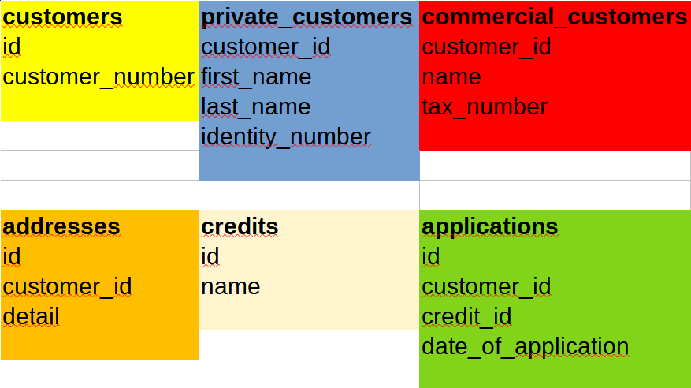
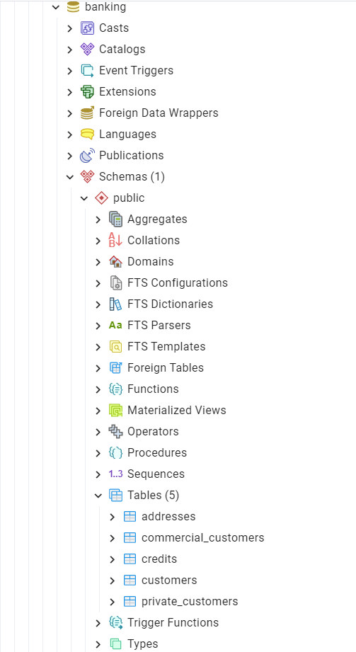

# 💸 Design of a Simple Banking Database:

- We work in the banking sector
- Our customers can be either individuals or businesses
- Design only the customer tables
- Design the structure to store customer addresses
- Define a customer number for each customer
- Design a system to manage loans
- Customers should be able to apply for loans. Define an application system

<br>

<details>
<summary>Entity Diagram</summary>
   
</details>

<details>
<summary>PostgreSQL query</summary>
   
```SQL
--CREATE DATABASE

CREATE DATABASE banking
WITH
OWNER = postgres
ENCODING = 'UTF8'
CONNECTION LIMIT = -1
IS_TEMPLATE = False;

--CREATE TABLES customers

CREATE TABLE public.customers
(
id integer,
customer_number character(6),
CONSTRAINT pk_customers PRIMARY KEY (id),
CONSTRAINT uk_customers_customer_name UNIQUE (customer_number)
);

ALTER TABLE IF EXISTS public.customers
OWNER to postgres;

--CREATE TABLES private_customers

CREATE TABLE public.private_customers
(
customer_id integer,
first_name character varying(50),
last_name character varying(50),
identity_number character(11),
CONSTRAINT pk_private_customers PRIMARY KEY (customer_id),
CONSTRAINT uk_private_customers_identity_number UNIQUE (identity_number),
CONSTRAINT fk_private_customers_customer_id_id FOREIGN KEY (customer_id)
REFERENCES public.customers (id) MATCH SIMPLE
ON UPDATE NO ACTION
ON DELETE NO ACTION
NOT VALID
);

ALTER TABLE IF EXISTS public.private_customers
OWNER to postgres;

--CREATE TABLES commercial_customers

CREATE TABLE public.commercial_customers
(
customer_id integer,
name character varying(250),
tax_number character(10),
CONSTRAINT pk_commercial_customers PRIMARY KEY (customer_id),
CONSTRAINT uk_commercial_customers_tax_number UNIQUE (tax_number),
CONSTRAINT fk_commercial_customers_customer_id_id FOREIGN KEY (customer_id)
REFERENCES public.customers (id) MATCH SIMPLE
ON UPDATE NO ACTION
ON DELETE NO ACTION
NOT VALID
);

ALTER TABLE IF EXISTS public.commercial_customers
OWNER to postgres;

--CREATE TABLES credits

CREATE TABLE public.credits
(
id integer,
name character varying(50),
PRIMARY KEY (id)
);

ALTER TABLE IF EXISTS public.credits
OWNER to postgres;

--CREATE TABLES addresses

CREATE TABLE public.addresses
(
id integer,
customer_id integer,
credit_id integer,
date_of_application timestamp without time zone,
CONSTRAINT pk_addresses PRIMARY KEY (id),
CONSTRAINT uk_customer_id_credit_id UNIQUE (customer_id, credit_id),
CONSTRAINT fk_addresses_customer_id_id FOREIGN KEY (customer_id)
REFERENCES public.customers (id) MATCH SIMPLE
ON UPDATE NO ACTION
ON DELETE NO ACTION
NOT VALID,
CONSTRAINT fk_addresses_credit_id_id FOREIGN KEY (credit_id)
REFERENCES public.credits (id) MATCH SIMPLE
ON UPDATE NO ACTION
ON DELETE NO ACTION
NOT VALID
);

ALTER TABLE IF EXISTS public.addresses
OWNER to postgres;

```

</details>


<details>
<summary>Output</summary>
   
</details>


<br>

[<--](../ReadMe.md)
```
