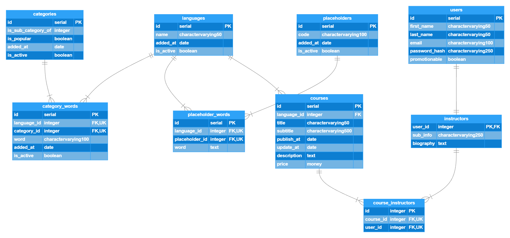

# 📺 Udemy Database Design:

<details>
<summary>Entity Diagram</summary>
   
</details>

<details>
<summary>PostgreSQL query</summary>
   
```SQL

---CREATE DATABASE udemy_demo

CREATE DATABASE udemy_demo
WITH
OWNER = postgres
ENCODING = 'UTF8'
CONNECTION LIMIT = -1
IS_TEMPLATE = False;

---CREATE TABLE languages

CREATE TABLE public.languages
(
id serial,
name character varying(50),
added_at date,
is_active boolean,
CONSTRAINT pk_languages PRIMARY KEY (id)
);

ALTER TABLE IF EXISTS public.languages
OWNER to postgres;

---CREATE TABLE categories

CREATE TABLE public.categories
(
id serial,
is_sub_category_of integer NOT NULL,
is_popular boolean,
added_at date,
is_active boolean,
CONSTRAINT pk_categories PRIMARY KEY (id)
);

ALTER TABLE IF EXISTS public.categories
OWNER to postgres;

---CREATE TABLE category_words

CREATE TABLE public.category_words
(
id serial,
language_id integer,
category_id integer,
word character varying(100),
added_at date,
is_active boolean,
CONSTRAINT pk_category_words PRIMARY KEY (id),
CONSTRAINT uk_category_words_language_id_category_id UNIQUE (language_id, category_id),
CONSTRAINT fk_category_words_language_id_id FOREIGN KEY (language_id)
REFERENCES public.languages (id) MATCH SIMPLE
ON UPDATE NO ACTION
ON DELETE NO ACTION
NOT VALID,
CONSTRAINT fk_category_words_category_id_id FOREIGN KEY (category_id)
REFERENCES public.categories (id) MATCH SIMPLE
ON UPDATE NO ACTION
ON DELETE NO ACTION
NOT VALID
);

---CREATE TABLE placeholders

CREATE TABLE public.placeholders
(
id serial,
code character varying(100),
added_at date,
is_active boolean,
CONSTRAINT pk_placeholders PRIMARY KEY (id)
);

ALTER TABLE IF EXISTS public.placeholders
OWNER to postgres;

---CREATE TABLE placeholder_words

CREATE TABLE public.placeholder_words
(
id serial,
language_id integer,
placeholder_id integer,
word text,
CONSTRAINT pk_placeholder_words PRIMARY KEY (id),
CONSTRAINT uk_placeholder_words_language_id_placeholder_id UNIQUE (language_id, placeholder_id),
CONSTRAINT fk_placeholder_words_language_id_id FOREIGN KEY (language_id)
REFERENCES public.languages (id) MATCH SIMPLE
ON UPDATE NO ACTION
ON DELETE NO ACTION
NOT VALID,
CONSTRAINT fk_placeholder_words_placeholder_id_id FOREIGN KEY (placeholder_id)
REFERENCES public.placeholders (id) MATCH SIMPLE
ON UPDATE NO ACTION
ON DELETE NO ACTION
NOT VALID
);

ALTER TABLE IF EXISTS public.placeholder_words
OWNER to postgres;

---CREATE TABLE courses

CREATE TABLE public.courses
(
id serial,
language_id integer,
title character varying(50),
subtitle character varying(500),
publish_at date,
update_at date,
description text,
price money,
CONSTRAINT pk_courses PRIMARY KEY (id),
CONSTRAINT fk_courses_language_id FOREIGN KEY (language_id)
REFERENCES public.languages (id) MATCH SIMPLE
ON UPDATE NO ACTION
ON DELETE NO ACTION
NOT VALID
);

ALTER TABLE IF EXISTS public.courses
OWNER to postgres;

---CREATE TABLE user

CREATE TABLE public."user"
(
id serial,
first_name character varying(50),
last_name character varying(50),
email character varying(100),
password_hash character varying(250),
promotionable boolean,
CONSTRAINT pk_users PRIMARY KEY (id),
CONSTRAINT uk_users_email UNIQUE (email)
);

ALTER TABLE IF EXISTS public."user"
OWNER to postgres;

---CREATE TABLE instructors

CREATE TABLE public.instructors
(
user_id integer,
sub_info character varying(250),
"Biography" text,
CONSTRAINT pk_instructors PRIMARY KEY (user_id),
CONSTRAINT fk_instructors_user_id_id FOREIGN KEY (user_id)
REFERENCES public."user" (id) MATCH SIMPLE
ON UPDATE NO ACTION
ON DELETE NO ACTION
NOT VALID
);

ALTER TABLE IF EXISTS public.instructors
OWNER to postgres;

---CREATE TABLE course_instructors

CREATE TABLE public.course_instructors
(
id integer,
course_id integer,
user_id integer,
CONSTRAINT pk_course_instructors PRIMARY KEY (id),
CONSTRAINT uk_coursee_instructors_course_id_user_id UNIQUE (course_id, user_id),
CONSTRAINT fk_course_instructors_course_id_id FOREIGN KEY (course_id)
REFERENCES public.courses (id) MATCH SIMPLE
ON UPDATE NO ACTION
ON DELETE NO ACTION
NOT VALID,
CONSTRAINT fk_course_instructors_user_id_user_id FOREIGN KEY (user_id)
REFERENCES public.instructors (user_id) MATCH SIMPLE
ON UPDATE NO ACTION
ON DELETE NO ACTION
NOT VALID
);

ALTER TABLE IF EXISTS public.course_instructors
OWNER to postgres;

```

</details>


<details>
<summary>Output</summary>
   
</details>

<br>

[<--](../ReadMe.md)
```
