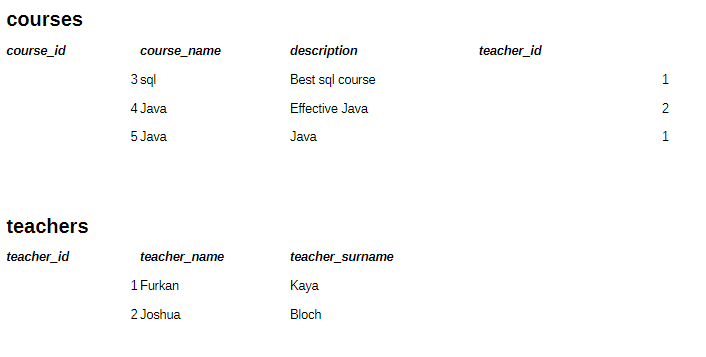
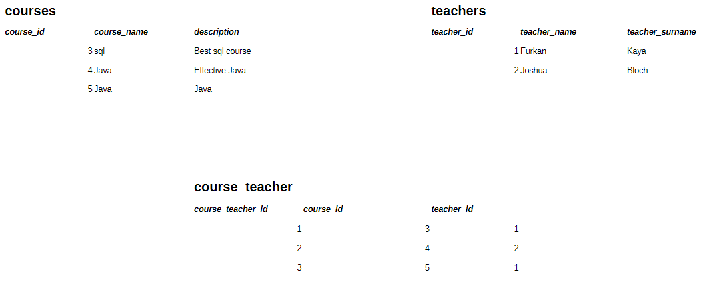

# 🫡 Workshop1

#### 1️⃣ Simple educational portal:

- Keeping track of course information.
- Tracking of teacher information.
- A course can have only one teacher.

Workshop 1

    

 

#### 2️⃣ Simple educational portal:

- Keeping track of course information.
- Tracking of teacher information.
- A course can have one or multiple teachers.

Workshop 1

    

 

[<--](../ReadMe.md)
