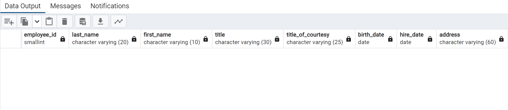

# 🫡 Workshop2

#### [Northwind](../northwind.sql) database queries:

- Are there any employees in the `Northwind` database who have not made any sales? If so, who are they?

<details>
<summary>SQL query</summary>
   
```SQL
SELECT * FROM employees e LEFT JOIN orders o
ON e.employee_id = o.employee_id
WHERE o.employee_id IS NULL
```

</details>

<details>
<summary>Output</summary>
   
</details>

<br>

[<--](../ReadMe.md)
