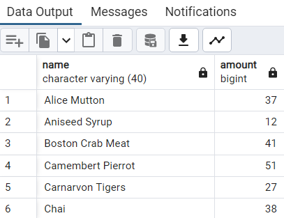

# 🫡 Workshop3

#### [Northwind](../northwind.sql) database queries:

- How many units of which product have been sold in the `Northwind` database?

<details>
<summary>SQL query</summary>
   
```SQL
SELECT p.product_name AS name, count(p.product_name) AS amount
FROM products p INNER JOIN order_details od
ON p.product_id = od.product_id
GROUP BY p.product_name
ORDER BY p.product_name
```

</details>

<details>
<summary>Output</summary>
   
</details>

<br>

[<--](../ReadMe.md)
