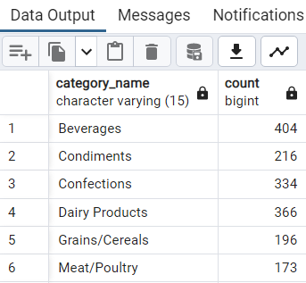

# 🫡 Workshop4

#### [Northwind](../northwind.sql) database queries:

- How many units have been sold from which category in the `Northwind` database?

<details>
<summary>SQL query</summary>
   
```SQL
SELECT c.category_name, count(*) FROM products AS p INNER JOIN categories AS c
ON p.category_id = c.category_id
INNER JOIN order_details AS od
ON od.product_id = p.product_id
GROUP BY c.category_name
ORDER BY c.category_name
```

</details>

<details>
<summary>Output</summary>
   
</details>

<br>

[<--](../ReadMe.md)
