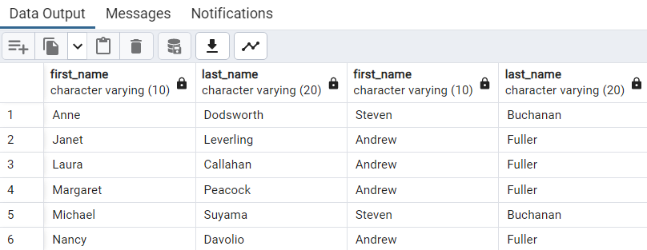

# 🫡 Workshop5

#### [Northwind](../northwind.sql) database queries:

- In the `Northwind` database, the emplotee's name, surname and the superior's name and surname

<details>
<summary>SQL query</summary>
   
```SQL
SELECT e2.first_name , e2.last_name, e1.first_name , e1.last_name
FROM employees AS e1 INNER JOIN employees AS e2
ON e1.employee_id = e2.reports_to
ORDER BY e2.first_name
```

</details>

<details>
<summary>Output</summary>
   
</details>

<br>

[<--](../ReadMe.md)
